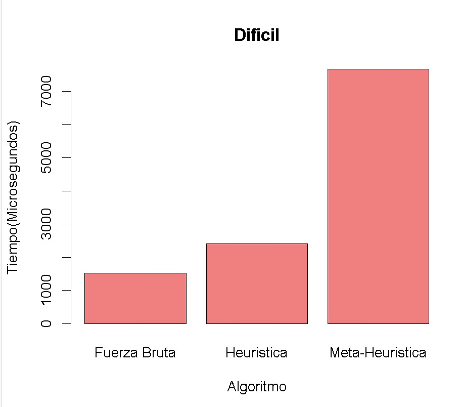

# Sudoku

Se desarrolló un programa que genera un tablero de sudoku de dimensiones 9x9. El programa cuenta con 3 niveles, para asemejar la dificultad de los niveles se borran K celdas
- Primer nivel: 10 celdas
- Segundo nivel: 25 celdas
- Tercer nivel: 60 celdas

Además para implementar el solucionador del tablero, se crearon tres métodos.
1. Fuerza bruta
1. Heurística (reducción de candidatos)
1. Metaheurística (Algoritmo génetico)

## Ejecución
Para ejecutar el programa se deben seguir los siguientes pasos:
>make

>./sudoku n m

* Donde `n` especifica el método a solucionar
  * 0 => Fuerza Bruta
  * 1 => Heurística
  * 2 => Metaheurística
* Donde `m` especifica el nivel a ejecutar
  * 1 => Primer nivel
  * 2 => Segundo nivel
  * 3 => Tercer nivel
 
## Comparación entre métodos

### Fuerza Bruta

La función de **fuerza bruta** intenta llenar cada casilla del Sudoku con números válidos, probando diferentes combinaciones hasta que encuentre una solución o encuentre que no es posible resolverlo. Utiliza recursión para explorar diferentes caminos y retroceder cuando sea necesario.

En los resultados se observa una mayor velocidad en la **fuerza bruta** para resolver los sudokus en todos los niveles de dificultad, esto podría deberse al tamaño de los sudokus que es de 9x9, posiblemente en problemas con un sudoku de dimensiones más grandes, la velocidad con la se ejecuten los sudokus por **fuerza bruta** crecerá de forma exponencial lo que resultaría en que este método se vuelva inviable en este tipo de escenarios.

### Heurística

Como se observa la heurística obtuvo un buen desempeño en todos los niveles: `fácil`, `medio`, `difícil`, esto se debe al **descarte de candidatos**. En cada iteración se cálculan los candidatos por cada celda y a partir de ellos se asigna un valor a la celda y se prueba si esa solución es válida. Por el **descarte de candidatos**, se tienen que realizar menos iteraciones, pues hay una menor cantidad de posibilidades a intentar.

En cada iteración se actualizan los candidatos, pues cuando se asigna una nueva celda, este número se debe eliminar de los posibles candidatos correspondientes: todas las celdas de esa fila y columna, y todas las celdas de su subgrupo.

### Metaheurística

Se escogió el **algoritmo genético** como la meta-heurística a desarrollar para resolver el sudoku. Para este se hicieron funciones de mutación, cruzado y de población. 

> Mutación: Se escogió un porcentaje de mutación del 30% ya que era el número perfecto para que diera las mejores soluciones. Probando con porcentajes de mutación muy bajos causó que las soluciones se quedaran estancadas y no mejoran, mientras que mucha mutación causó que unas buenas soluciones empeoran debido a que cambiaba mucho sus valores.

> Cruzado: Para el algoritmo de cruzado se escogió un  método simple en el que se escogen parejas aleatoriamente de la población, y se mezclan las soluciones en este hijo. Estos hijos se ingresan a la población general, y se eliminan las peores 50 soluciones, para quedar con las mismas 100 iniciales. 

> Población: Para la creación de la población inicial, se optó por tratar de situar la mayor cantidad de valores válidos en las casillas, y de no ser posible entonces se ponía uno aleatorio. Esto mejoró enormemente el rendimiento del algoritmo inicial que solo ponía valores aleatorios como su población. 

> Rendimiento: Este algoritmo mostró tener un peor rendimiento que los demás algoritmos del proyecto. Esto puede ser debido a que las operaciones que realiza en cada iteración pueden llegar a ser muchas. Además que entre cada iteración las soluciones no tienden a mejorar mucho, ya que por la naturaleza del sudoku, cambiar un número de una solución, podría invalidar toda una respuesta. Por lo que se necesitan muchas iteraciones para avanzar hacia la solución correcta.

## Gráficos Comparativos

## Creditos

Randy Steven Robles Vega, B96557

Fabian Vega Meza, C08369

Sebastián Venegas Brenes, C18440
